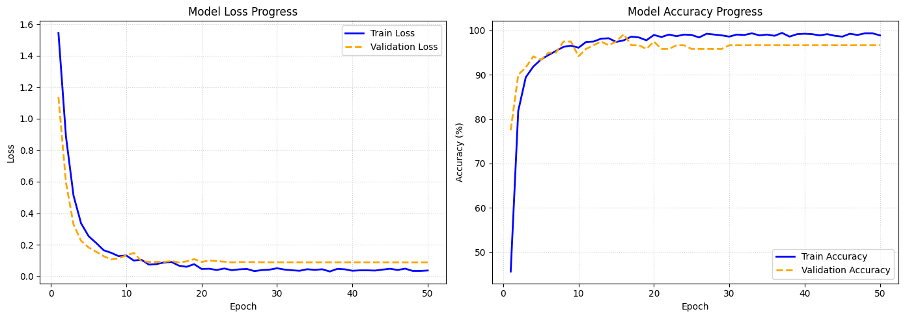
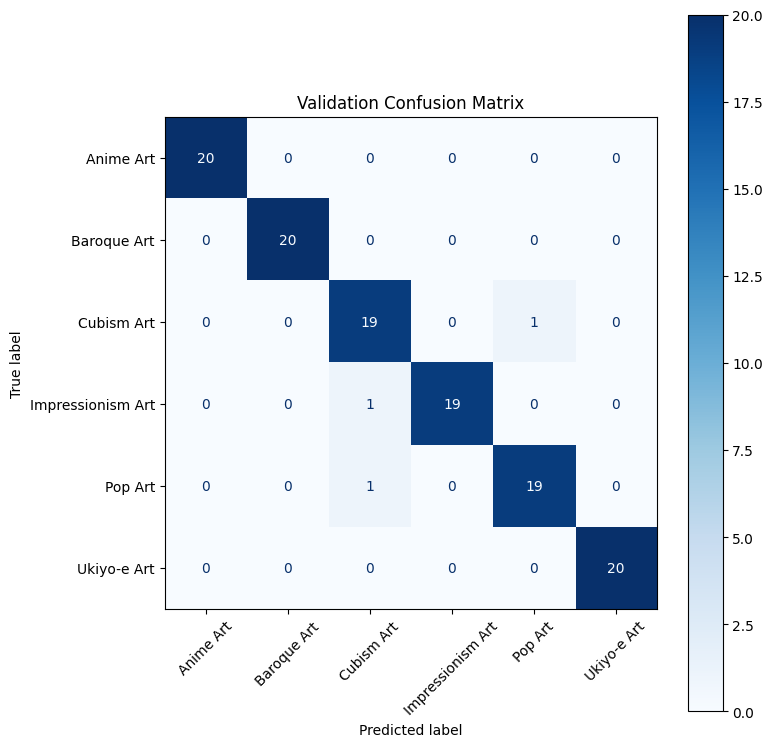

# ViT Art Genre Classification

<a target="_blank" href="https://colab.research.google.com/github/czhang0673/vit-art-classifier/blob/main/vit_art_classification.ipynb">
  
</a>

## About This Project
This project demonstrates the fine-tuning of a Vision Transformer (ViT-B/16) to classify art styles across 6 distinct genres: **Anime, Baroque, Cubism, Impressionism, Pop Art, and Ukiyo-e.**

The pipeline uses transfer learning to adapt a pre-trained Transformer architecture to domain-specific art imagery, achieving high classification accuracy despite the nuanced visual differences between artistic movements.

## Key Features
* **Architecture:** Utilizes a Vision Transformer (ViT) backbone implemented via PyTorch/Torchvision.
* **Training Pipeline:** Includes Early Stopping, learning rate scheduling, and automated checkpointing.
* **Evaluation:** Features automated performance metrics, including Loss/Accuracy learning curves and a detailed Confusion Matrix.
* **Inference:** A dedicated function to run single-image inference on new, unseen art uploads.

## Project Structure
* `vit_art_classification.ipynb`: The primary notebook containing the training loop, evaluation, and inference logic.
* `requirements.txt`: List of dependencies required to run the notebook locally.

## Getting Started
### Running in Google Colab (Recommended)
Click the "Open in Colab" badge above. Ensure you have a GPU runtime enabled in Colab for the fastest inference experience.

### Local Installation
If running locally, install the necessary dependencies:
```bash

## Results

### Model Performance
The fine-tuned ViT-B/16 model achieved a final **Validation Accuracy of 97.50%**. 



As shown in the training plots, the model converged quickly within the first 10-15 epochs. The validation loss tracks closely with the training loss, indicating that the data augmentation strategy (RandomResizedCrop, ColorJitter) effectively prevented overfitting.

### Confusion Matrix Analysis
The model demonstrates near-perfect classification for styles with distinct line work and palettes like **Anime Art**, **Baroque**, and **Ukiyo-e**.



* **Perfect Scores:** Anime Art (20/20), Baroque Art (20/20), and Ukiyo-e Art (20/20).
* **Minor Confusion:** There is a slight overlap between **Cubism** and **Pop Art**. This is expected, as both genres often feature bold, flattened shapes and vibrant, non-traditional color palettes.

### Qualitative Analysis (Error Inspection)
By inspecting the misclassified images, we can see that the model's "mistakes" are often visually logical. 


For instance, an impressionist still life of fish was misclassified as cubism. This is likely due to the sharp angles of the table and the heavy, visible brushstrokes that the Vision Transformer interpreted as geometric fragmentation rather than soft impressionist light.
